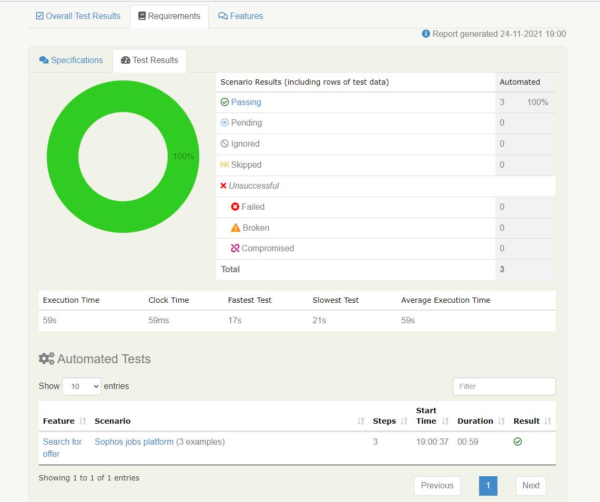
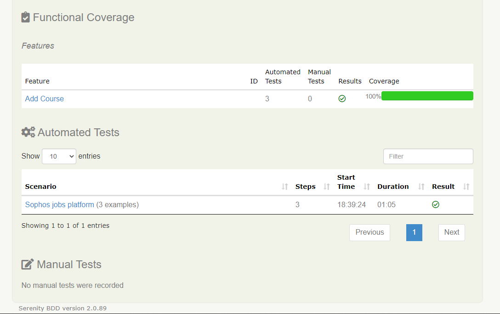
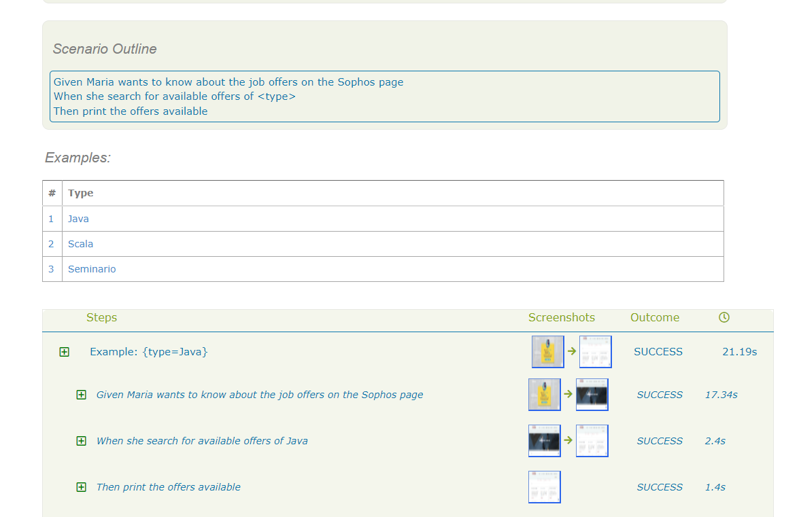
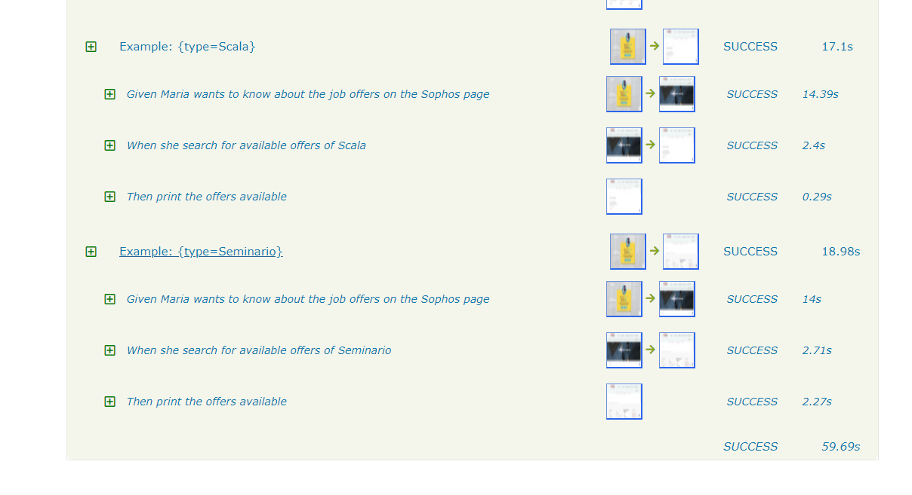

# Reto Sophos

## Descripción
Los datos entregados en este reto corresponde a la automatización realizada a la página de Sophos, donde se busca realizar la búsqueda de ofertas laborables disponibles en la plataforma.

## Antes de ejecutar

Es necesario tener en cuenta que este proyecto fue ejecutado con con chromedriver para Windows.

- Si su sistema operativo es diferente debe modificar en el archivo serenity.properties.
> webdriver.chrome.driver = src/test/resources/driver/chromedriver y cambiarlo por el driver que se ajuste a nuestro sistema operativo.
  
## Pasos para clonar el proyecto

> En la terminal "CMD" busca la carpeta a guardar el proyecto

- > Colocar  " dir "
  >
  > Escoges la carpeta y coloca su nombre " dir Documents "
  >
  >Te paras en esa carpeta " cd (nombre de la carpeta) "
  >
 > Copias la URL del proyecto y lo pegas así:

    > git clone https://github.com/pattyvillaj/RetoSophos.git
    
 ## Construido con:
 
En la Solución al reto de automatización de Sophos se uso:
  
  - Java
  - Serenity BDD(Cucumber BDD)
  - Screenplay 
  - Lenguaje gherkin
  - Gradle
  
## Resultado de la Automatización

